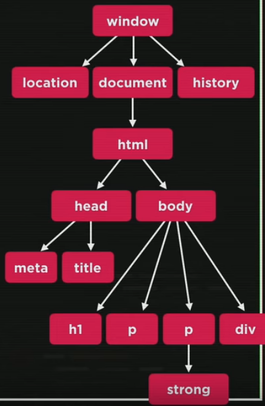

# Lesson 05

In this lesson we understood the Document Object Model (DOM).

## Contents

### DOM Tree

Javascript follows the DOM Tree hierarchy. The DOM Tree of this lesson is the following:

### Selectors

- **getElementsByTagName**("*tag*") returns an array of objects;
- **getElementByID**("*id*") returns the object;
- **getElementsByName**("*name*") returns an array of objects;
- **getElementsByClassName**("*name*") returns an array of objects.

#### Query Selectors

- **querySelector**(*query*) returns the object;
- **querySelectorAll**(*query*) returns an array of objects.

### Commands

- innerText: Gets the text of the selected element;
- innerHTML: Gets the html of the selected element.
